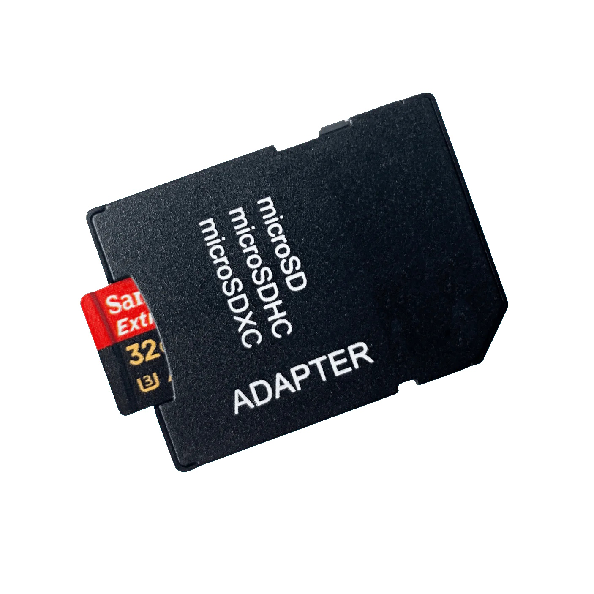
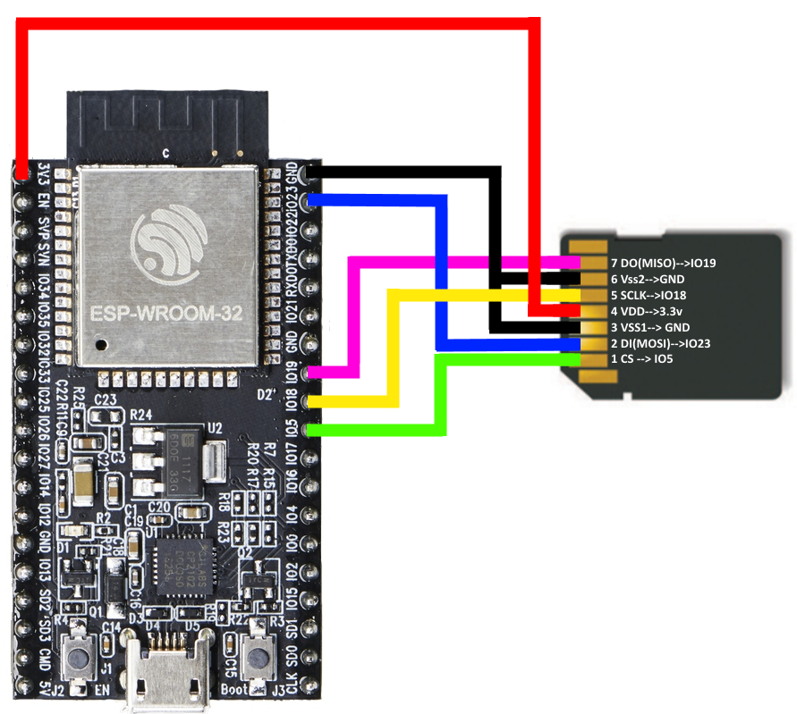
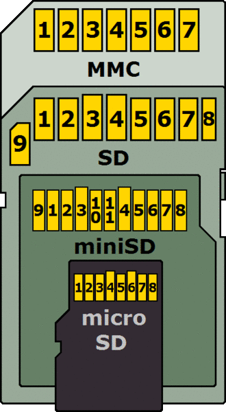
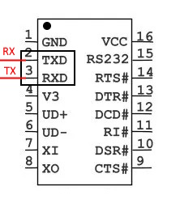
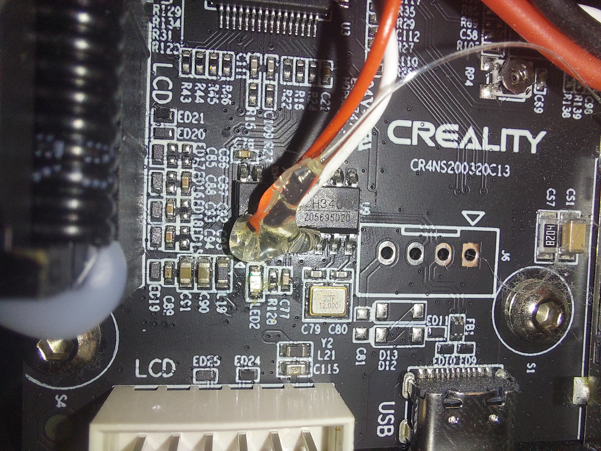
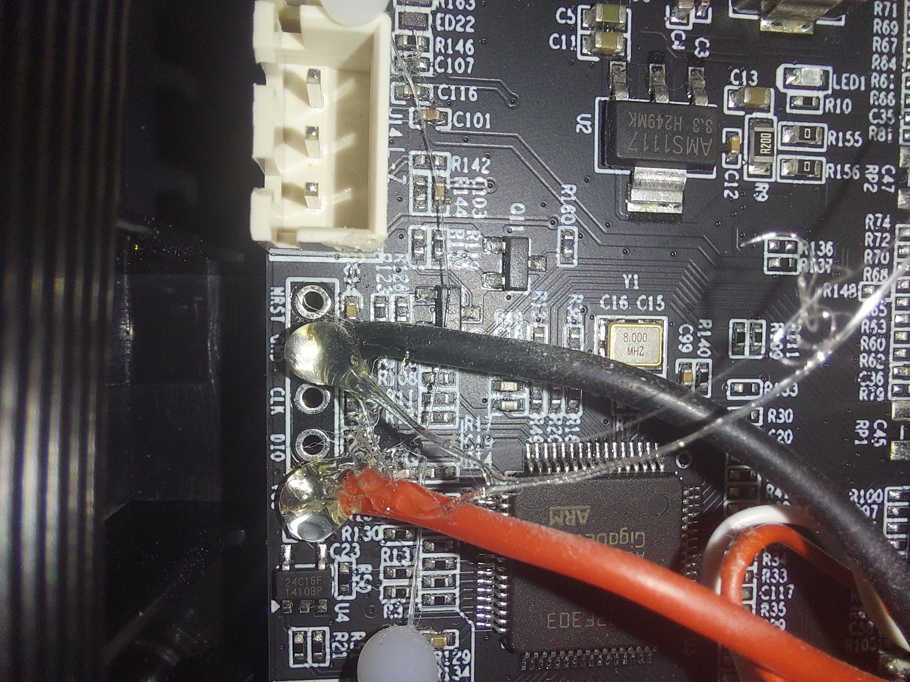

   

# Trioprint

## Overview
Trioprint is a 3D printing project designed to enhance the capabilities of non-networked 3D printers. By utilizing an ESP32-based extension board and custom software, Trioprint adds features such as remote control, monitoring, and automation, improving the performance and user experience of your 3D printer. Trioprint includes usefull web interface. Files can be uploaded using drag & drop. Print can be monitored in real time and can be paused and stoped. An emergency stop functionality is included in case print fails.

## Features
- **Support for ESP32 and esp8266**: Integrates seamlessly with your 3D printer, enabling network connectivity and remote control.
- **Custom Software**: Offers advanced features like remote monitoring, automation, and real-time status updates.
- **Optimized Printing**: Enhances the overall performance and efficiency of your 3D printer.
- **mDNS** which allows to key the name defined in web browser and connect only with bonjour installed on compute
- **Fail safe mode (Access point)** is enabled if cannot connect to defined station at boot.

> [!WARNING]
>### Disclaimer
> The software is provided 'as is,' without any warranty of any kind, expressed or implied, including but not limited to the warranties of merchantability, fitness for a particular purpose, and non-infringement. In no event shall the authors or copyright holders be liable for any claim, damages, or other liability, whether in an action of contract, tort, or otherwise, arising from, out of, or in connection with the software or the use or other dealings in the software.
>It is essential that you carefully read and understand this disclaimer before using this software and its components. If you do not agree with any part of this disclaimer, please refrain from using the software.  

## File Structure
- `web/`: Web interface files.
  - `main/`: Contains core web files including `index.html`, `index.css`, and `compile.py`.
  - `config/`: Configuration interface files and `compress.py` for web interface setup. This interface is stored localy on the esp thus even if you delete the main html page, you have way to recover.

## Getting Started

1. **Compile Web Interface**:
   - Navigate to the `web/main` folder and run `compile.py` to generate the compiled HTML.
   - Upload the `compiled.html.gz` file to your SD card.

2. **Generate Config Files**:
   - Navigate to `web/config` and run `compress.py` to generate the  configurator html files.

3. **Hardware Setup**:
   - Insert the SD card into the ESP32 and configure `PIN_SPI_SS_SD` in `config.h` to match the SD card's chip select pin.

      if your esp does not sd card slot you can solder wires into micro SD to SD adapter. THis way you can still use the sd card on computer. Or you can also buy one of those development boards.
   

      
   

   

      
   

   

      
   

   #### Default SPI pins:
   Note that SPI pins can be configured by using `SPI.begin(sck, miso, mosi, cs);` alternatively, you can change only the CS pin with `SD.begin(CSpin)`

   | SPI Pin Name | ESP8266 | ESP32 | ESP32‑S2 | ESP32‑S3 | ESP32‑C3 | ESP32‑C6 | ESP32‑H2 |
   |--------------|---------|-------|----------|----------|----------|----------|----------|
   | CS (SS)      | GPIO15  | GPIO5 | GPIO34   | GPIO10   | GPIO7    | GPIO18   | GPIO0    |
   | DI (MOSI)    | GPIO13  | GPIO23| GPIO35   | GPIO11   | GPIO6    | GPIO19   | GPIO25    |
   | DO (MISO)    | GPIO12  | GPIO19| GPIO37   | GPIO13   | GPIO5    | GPIO20   | GPIO11    |
   | SCK (SCLK)   | GPIO14  | GPIO18| GPIO36   | GPIO12   | GPIO4    | GPIO21   | GPIO10    |

   ---

   - Set correct EMS and STOP commands in `config.h`. Default is for Ender 3 v3 SE
   
   Flash the firmware to the ESP32 using the Arduino IDE. Ensure you have the necessary libraries installed.

4. **Network Configuration**:
   - Connect to the Wi-Fi network `trioprint` (password: `trioprint`).
   - Access the configuration page via a browser at `192.168.1.1`. If not prompted, navigate to `/server/config`.

5. **Printer Connection**:
   - After verifying that all functionality works, connect the ESP32 to the printer's UART port (not the USB port). If the SD card is not detected or the device cannot connect to the network, double-check all wiring connections and ensure the Wi-Fi credentials are correct. 

   Ender 3 V3 SE includes CH340T chip as USB to UART bridge. Solder to the TX and RX pins. Connect the other end of wires to ESP serial lines. You might have to swap the RX and TX pins.
   

      
   

   on Ender 3 V3 SE the chip is located there:
   

      
   

   Optionally, connect 3.3V and ground to power the ESP32 from the printer when powered on.
      

      
   

6. **Testing and Operation**:
   - Power up the printer and test the setup by uploading a file to the SD card and checking the printer's connectivity at `[IP]/` or `http://[name].local`. You can check ip via serial if serial debug is enabled. (laptop, pc or Android phone can be used).
   - Use a dedicated tablet or any device with a browser as the user interface. Personally I use old ipad. The only place where I allow Apple device to be used.

7. **Updates**:
   - For firmware updates, use the OTA feature or connect via USB to the ESP32 for updates after assembling the printer. Printers own USB port can't be used! Currently versioning is based on time at compile. (`__TIME__`) And if new version is detected, your preferences are reseted because memory layout might have been changed.

### Note for ESP32 Without SD Card
If your ESP32 does not have an SD card, you can still use TrioPrint by uploading the necessary files directly to the ESP32's flash memory. Ensure you configure the firmware accordingly to access the files from flash instead of an SD card.

## Development and features
| Feature                  | ESP32 | ESP8266|
|--------------------------|:-----:|:-------:|
| Wi-Fi                    |   ✅  |   ✅   |
| Bluetooth                |   🚧  |   ❌   |
| UART                     |   ✅  |   ✅   |
| USB Interface            |   🚧  |   🚧   |
| USB Debug                |   ✅  |   ✅   |
| WEB Interface            |   ✅  |   ✅   |
| SD Card Support          |   ✅  |   ✅   |
| Run Gcode From SD Card   |   ✅  |   ✅   |

**Note:** For ESP8266, compilation is successful but no testing has been done.

**Note:** Bluetooth would require an app

This project uses an asynchronous web server to provide a smooth user experience, ensuring that activities like loading the website or downloading files do not block ongoing print jobs. Developing this system is somewhat complex, as SD card operations must be carefully synchronized to prevent conflicts. If SD card access is required during development, it is important to review and understand the web server code thoroughly to maintain proper synchronization.

The codebase is currently kinda messy — refactoring is in progress.

A custom debug interface should be added to make debugging easier via serial and web interface. Currently, it's just Serial prints...

Compress the main user interface always to keep memory usage down. In web serve code correct headers are sent always.

## Dependencies
- [ESP32 Arduino Core](https://github.com/espressif/arduino-esp32): Required for ESP32 development.
- [SdFat Library](https://github.com/greiman/SdFat): For SD card operations.
- [ESPAsyncWebServer](https://github.com/me-no-dev/ESPAsyncWebServer): For handling web server requests.
- [AsyncTCP](https://github.com/ESP32Async/AsyncTCP): Required for handling web sockets
- [ESP_EEPROM](https://github.com/jwrw/ESP_EEPROM): Handling dynamic memory
- [ESPAsyncTCP](https://github.com/dvarrel/ESPAsyncTCP): for websockets and server

## Contributing
Contributions are welcome! Feel free to open issues or submit pull requests.

## License
This project is licensed under the [MIT License](LICENSE).

## Contact
For questions or support, contact [your-email@example.com].
